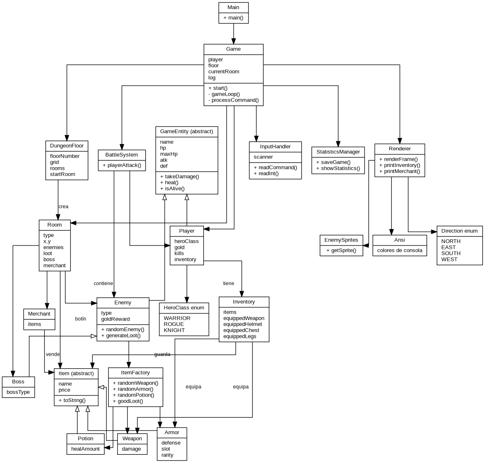

# DungeonCrawler

## Uso de inteligencia artificial

He usado IA como apoyo para revisar comentarios en español y preparar una explicación del proyecto. El código se mantiene con nombres originales y comentarios breves para que sea más fácil defenderlo.

## Descripción del proyecto

DungeonCrawler es un juego de consola en Java. El jugador elige una clase, explora una mazmorra de 5 pisos, lucha contra enemigos, compra objetos y busca derrotar al dragón final.

## Controles

- W A S D: moverse por el mapa.
- F: acción principal de la habitación.
- Q: abrir inventario.
- R: usar poción.
- B: rendirse.

## Organización real del código

```text
src/dungeon/
├── Main.java                         <- punto de entrada
├── igra/                             <- lógica principal
│   ├── Game.java                     <- menú, turnos y acciones
│   └── Bitva.java                    <- combate
├── personazhi/                       <- personajes
│   ├── Base.java                     <- base común
│   ├── Igrok.java                    <- jugador
│   ├── Vrag.java                     <- enemigos
│   ├── Boss.java                     <- jefe final
│   └── Torgovets.java                <- comerciante
├── veshchi/                          <- objetos e inventario
│   ├── Predmet.java                  <- objeto base
│   ├── Oruzhie.java                  <- armas
│   ├── Bronya.java                   <- armaduras
│   ├── Zele.java                     <- pociones
│   ├── Inventar.java                 <- inventario
│   └── Predmety.java                 <- fábrica de objetos
├── karta/                            <- mapa
│   ├── Komnata.java                  <- habitación
│   └── Etaj.java                     <- generación de piso
├── ekran/                            <- consola e interfaz
│   ├── Otrisovka.java                <- dibujo de pantalla
│   ├── SpraityVragov.java            <- sprites ASCII
│   └── ChitatelVvoda.java            <- lectura de teclado
├── dannye/
│   └── Statistika.java               <- guardado de estadísticas
└── utily/
    ├── Ansi.java                     <- colores ANSI
    ├── KlassGeroya.java              <- clases del héroe
    └── Napravlenie.java              <- direcciones
```

## Mecánicas principales

La clase `Game` dirige la partida: muestra el menú, crea el jugador, genera pisos, lee comandos y decide cuándo termina la partida.

`Etaj` genera un mapa 4x4 con habitaciones conectadas. Algunas habitaciones se convierten en salida, tienda, tesoro o sala del jefe.

`Bitva` resuelve el combate por turnos: primero ataca el jugador y, si el enemigo sigue vivo, responde el enemigo.

`Inventar` guarda los objetos del jugador y recuerda qué arma y armaduras están equipadas.

`Statistika` guarda cada partida en `statistics.txt` y permite mostrar un resumen desde el menú.

## Herencia

- `Base` -> `Igrok`
- `Base` -> `Vrag` -> `Boss`
- `Predmet` -> `Oruzhie`, `Bronya`, `Zele`

## Diagrama UML


